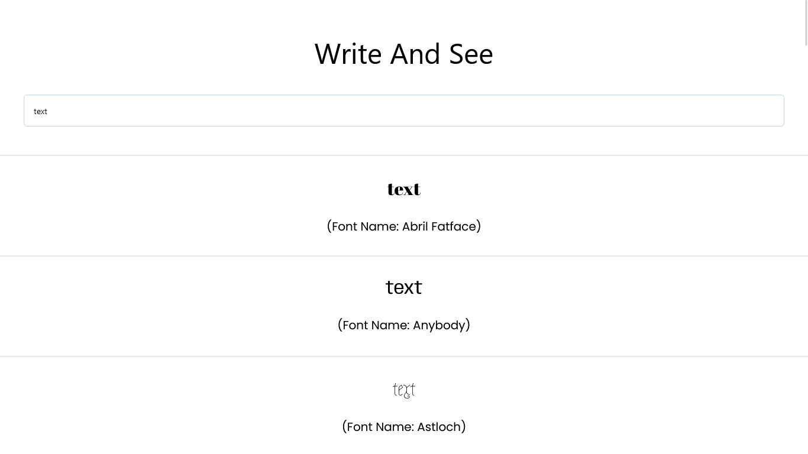

# Vue-TailwindCss-Font-Viewer

**_Vue TailwindCss Font Viewer_**

## Technologies

-   **Html**
-   **Css**
-   **TailwindCss**
-   **JavaScript**
-   **Vue**

## Dependencies

-   Vue-Router

## Project Setup Process

### Install npm (for npm packages)

```sh
npm install
```

### to run project in development environment

```sh
npm run dev
```

### Compile and Minify for Production

```sh
npm run build
```

### Lint with

```sh
npm run lint
```
